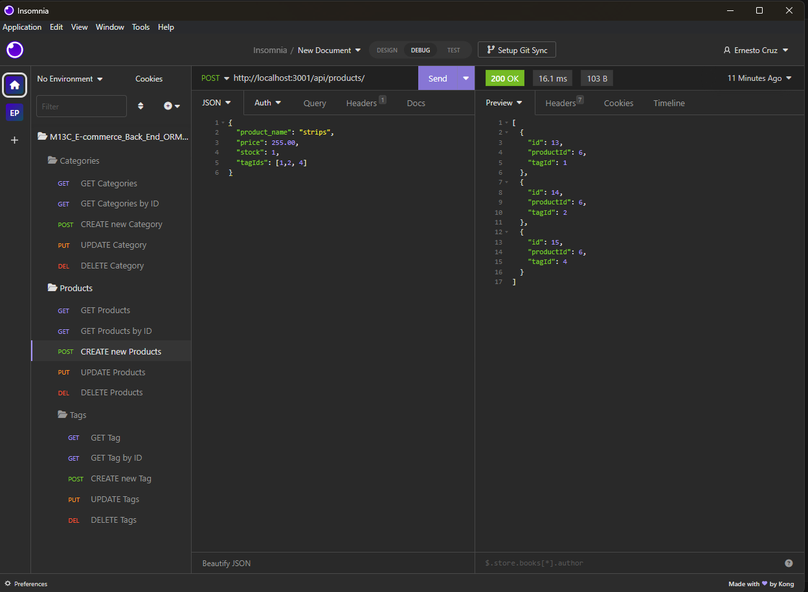

# M13C E-commerce Back-End (ORM) - ECR

## Description

A back end for an e-commerce site. From a working Express.js API to configure it to use Sequelize to interact with a MySQL database.
This project let the user GET, POST, PUT and delete data from the database. 

## Table of Contents
- [ Walkthrough ](#walkthrough)
- [ Instalation ](#instalation)
- [ Usage ](#usage)
- [ License](#license)
- [ Contributing](#Contributing)
- [ Test ](#test)
- [ Questions ](#questions)

## Walkthrough

The following video demonstrates the functionality of the backend using software insomia: 

see video here: [Walkthrough video](https://drive.google.com/file/d/1tf3U3cTRwPUxOt2-epJAm3BYlVbURUdd/view)

## Instalation

To install necessary dependencies, run the following command:

> npm i 

## Usage

1. Clone the repository to your local machine.
2. In the terminal, navigate to the repository directory.
3. Run the following command to generate a README file:

>npm run seed 

>npm start

  
## License
    
This project is licensed under the following license:

## Contributing

This repository is open source and contributions are welcome This code is based in the starter code from edX bootcamp. If you have any ideas for improvements, please feel free to open an issue or submit a pull request.

## Questions

If you have any questions about the repo, open an issue or contact me directly at [cruz.rosales.ernesto@gmail.com](mailto:cruz.rosales.ernesto@gmail.com). You can find more of my work at [neto1895](https://github.com/neto1895)

